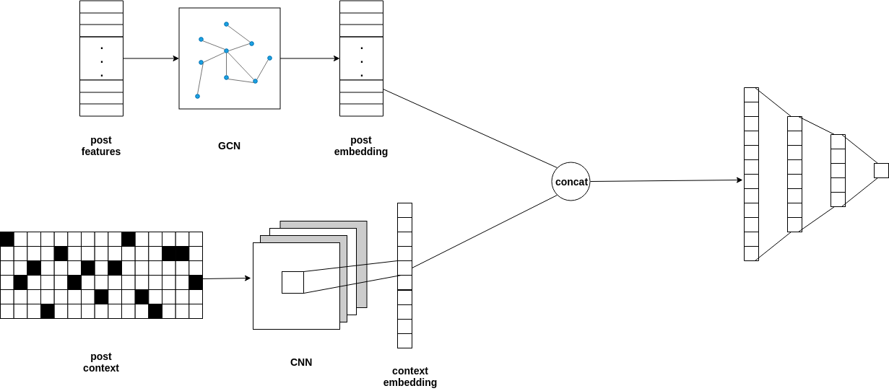

# Latent Relation Inference and Popularity Prediction

## Model

## Method

Given posts, we propose a deep learning model to predict popularity of posts. Without information about each user, our goals are to predict popularity of posts and learn some latent relationships among posts. We assume posts with similar topic and tags are more likely to be posted and replied by some certain users. On the other hand posts which a user prefer posting and replying to would be highly related.  
We have two inputs, first one is an one-hot vector showing posts owned and retweeted by a user, and second input is a sequence of one-hot vectors for each post encoding post context in character level. So that the inputs are $X_{POST} \in 2^{|\mathbb{V}|}$ and the context of each post $X_{CONTEXT}$. Our model output a real number indicating the prediction of popularity, which is measured by number of likes and replies.  
While training we use mean squared error to measure loss and stochastic gradient descent(SGD) to optimize. The step of training is similar to expectation-maximization where we consider the structure of posts as hidden variable. Firstly we initialize $\hat{A}$ with random values and train the model to update parameters $W_{GCN}$, $W_{CONTEXT}$ and $W_{FC}$ until convergence (maximization). Then we fix these parameters and use the same dataset to train only the _structure matrix_ $\hat{A}$ (expectation).

## Details

- [ ] if normalization is needed
- [ ] initialization of $\hat{A}$
- [ ] range of values in $\hat{A}$