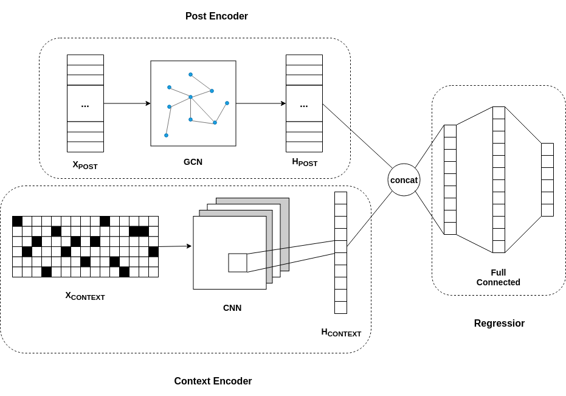

# Latent Relation Inference and Popularity Prediction

_Assumption_: posts with similar topic and tags are more likely to be posted and replied by some certain users. On the other hand posts which a user prefer posting and replying to would be highly related.

## Model

Given some information about posts from online social networks like Reddit, we propose a deep learning model to predict popularity of posts. Our model architecture consists of three components: a post encoder $E_{POST}$, a context encoder $E_{CONTEXT}$ and a regressior $R$.

The **post encoder** is a 3-layer graph convolutional network (GCN), which take as input of a 2-D one-hot matrix where each row denotes a post and each row is a user so that the input is $X_{POST} \in \{0,1\}^{|M|\times|N|}$. This input matrix shows how many and which users are involved in a certain post. Recall the definition of GCN, according to our assumption we initialize the adjacent matrix as inner product of our input which intuitively means the correlationship between posts. The 3-layer GCN will output a embedding representation $H_{POST} \in \mathbb R^{d_{POST}}$ for each post, where $d_{POST}$ is the dimension of embedding.

$$H^{(l+1)} = \sigma [ \hat D^{-\frac12} \hat A \hat D^{-\frac12} H^{(l)} W^{(l)} ]$$

The **context encoder** use post context information to build the correlationship between posts. To avoid the variance of learning word embedding from scratch and the bias of introducing existing word2vec, we train our context encoder in character level. Characters are transformed into one-hot vectors so we can get a sequence of one-hot vectors $X_{CONTEXT}$ for each post. Using the model proposed by _Yann LeCun et, al. 2015_, a 1-D convolutional network is applied to the input to extract text features and output post embedding $H_{CONTEXT} \in \mathbb R^{d_{CONTEXT}}$.

By concatenating outputs from above two encoders, the **regressior** learns with information from both user aspect and context. We build 3 fully connected layers to learn the popularity of each post given the cancatenated embedding representations, so the output is vector $\hat y \in \mathbb R^{|M|}$ and each dimension is a real number indicating the prediction of popularity.

## Training

Our goals are to 1) predict popularity of each post; 2) learn the latent relationship between posts, so we have two group of parameters should be learned. First are those weights between GCN, CNN and fully connected layers, and second is the adjacent matrix. However, the gradient directions of first group of parameters largely depend on the state of adjacent matrix, which means we can not update them simultaneously. We propose a training method based on expectation-maximization (EM) algorithm and update these parameters in two separated steps.

During maximization phrase, we first generate the input of post encoder as one-hot matrix $X_{POST} \in R^{|M|\times|N|}$ and initialize the adjacent matrix $\hat A$ in GCN with the inner product of $X_{POST}$. Meanwhile we map characters in each post to one-hot vectors and input the sequence of one-hot vectors into our context encoder. After forward propagation we get two distinguished embedding. Concatenate embeddings post by post (row by row) we get a new matrix with size $|M|\times(d_{POST}+d_{CONTEXT})$, and this will be the input of regressior. We measure our loss by calculating mean squared error (MSE) between the prediction and ground truth among all posts. By backpropagation, gradients are propagated back to the very beginning and all parameters except the adjacent matrix are updated to minimize the loss. This training process will be performed until the model converge.

In expectation phrase, all inputs and outputs are the same with those in maximization phrase, however, the only difference is the parameters that need to be updated. Our maximization phrase is based on the correlation assumption encoded in the adjacent matrix, so in expectation step it is the adjacent matrix that should be updated, while other parameters are fixed.
